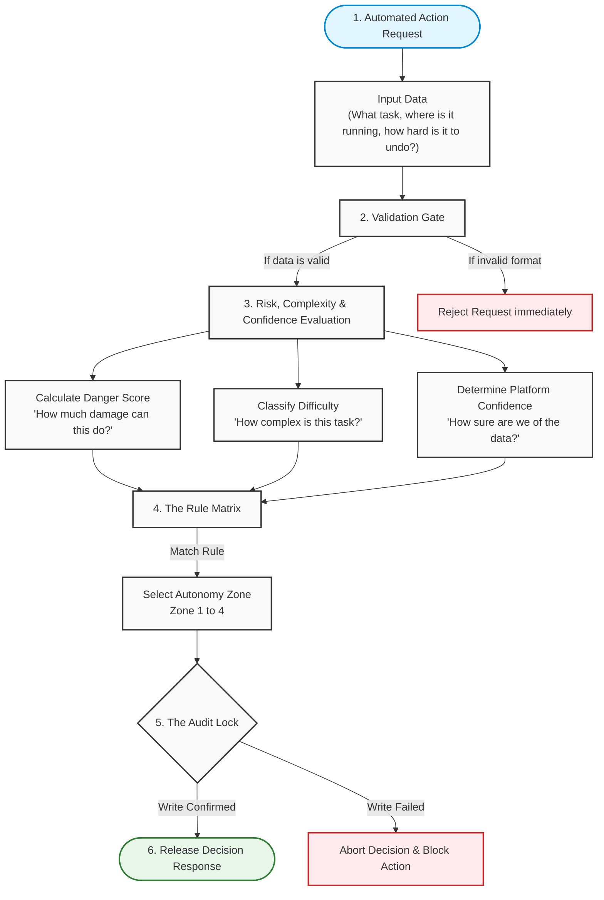

```mermaid
graph TD
    %% Define Nodes
    Start([1. Automated Action Request]) --> Input["Input Data<br>(What task, where is it running, how hard is it to undo?)"]
    Input --> Step1[2. Validation Gate]
    Step1 -->|If data is valid| Step2[3. Risk, Complexity & Confidence Evaluation]
    Step1 -->|If invalid format| Error[Reject Request immediately]

    Step2 --> Risk[Calculate Danger Score<br>'How much damage can this do?']
    Step2 --> Complexity[Classify Difficulty<br>'How complex is this task?']
    Step2 --> Confidence[Determine Platform Confidence<br>'How sure are we of the data?']

    Risk --> Step3[4. The Rule Matrix]
    Complexity --> Step3
    Confidence --> Step3

    Step3 -->|Match Rule| Zone[Select Autonomy Zone<br>Zone 1 to 4]

    Zone --> Step4{5. The Audit Lock}
    Step4 -->|Write Confirmed| Output([6. Release Decision Response])
    Step4 -->|Write Failed| Error500[Abort Decision & Block Action]

    %% Styles
    classDef default fill:#f9f9f9,stroke:#333,stroke-width:2px;
    classDef start fill:#e1f5fe,stroke:#0288d1,stroke-width:2px;
    classDef error fill:#ffebee,stroke:#c62828,stroke-width:2px;
    classDef success fill:#e8f5e9,stroke:#2e7d32,stroke-width:2px;

    class Start start;
    class Output success;
    class Error error;
    class Error500 error;
```